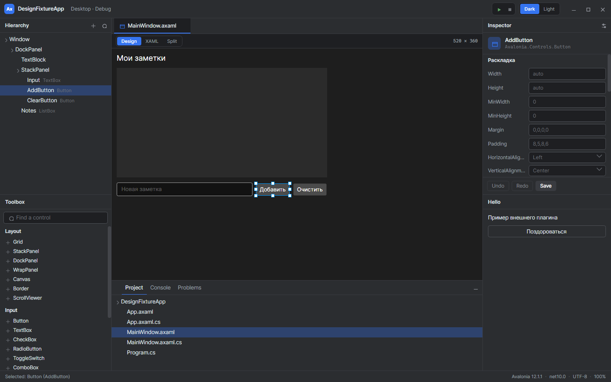
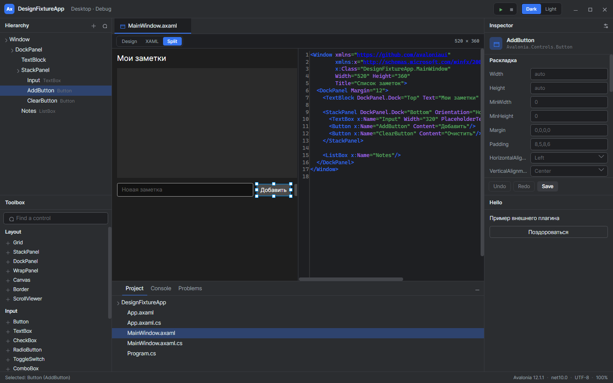

# ArxisStudio

Кроссплатформенный движок разработки приложений: Unity, но для прикладного
программного обеспечения. Форма собирается на канве из живых контролов, свойства
правятся в инспекторе, разметка тут же меняется в тексте, а сама студия
расширяется плагинами — как редактор Unity расширяется своими.



Дизайнер работает с настоящими объектами Avalonia, поднятыми из разметки
открытого проекта, а не с их изображением: выделенная кнопка на канве — это та
самая кнопка, которую увидит пользователь приложения.

## Как это устроено

Правка всегда идёт в документ, а не в объект. Инспектор, палитра, канва и
текстовый редактор — четыре двери в одну и ту же модель разметки, поэтому у них
общая история отмены, и набранное в тексте отменяется той же кнопкой, что и
сдвинутая мышью кнопка на форме.



Исходный документ — источник истины. Разметка хранится без потерь: правка одного
атрибута не трогает ни комментарии, ни отступы, ни порядок атрибутов, а
`Text="{Binding Customer.Name}"` не превращается в `Text="Алиса"` только потому,
что таково действующее значение.

## Состав

Студия собрана из библиотек, каждая со своим репозиторием; в этом они подключены
подмодулями в `external/`.

| Репозиторий | Что делает |
|---|---|
| [ArxisStudio.Markup](https://github.com/Arxis-Team/ArxisStudio.Markup) | Разметка без потерь: разбор, правка, живые объекты, догон изменений |
| [ArxisStudio.ProjectSystem](https://github.com/Arxis-Team/ArxisStudio.ProjectSystem) | Модель решения: MSBuild, ссылки, элементы, сборки проекта |
| [ArxisStudio.DesignEditor](https://github.com/Arxis-Team/ArxisStudio.DesignEditor) | Канва: выделение, перетаскивание, привязка к сетке, направляющие |
| [ArxisStudio.Controls](https://github.com/Arxis-Team/ArxisStudio.Controls) | Контролы студии (`Ax*`) — из них строятся и её интерфейс, и плагины |
| [ArxisStudio.Themes.Arxis](https://github.com/Arxis-Team/ArxisStudio.Themes.Arxis) | Тема: тёмная и светлая палитры, шаблоны контролов |

В самом репозитории — приложение (`src/ArxisStudio`), каркас окна и настройки
(`src/ArxisStudio.Shell`), контракт расширяемости (`src/ArxisStudio.Sdk`) и хост
плагинов (`src/ArxisStudio.Extensibility`).

## Что уже работает

- **Welcome** — недавние проекты, шаблоны из установленных `dotnet new`, менеджер
  плагинов, настройки; тема и язык переключаются на лету.
- **Дизайнер** — дерево документа, живая форма на канве, выделение в обе стороны,
  палитра контролов с вставкой щелчком и перетаскиванием, удаление и перестановка.
- **Инспектор** — свойства выделенного элемента разделами; строка знает, задано ли
  свойство в разметке, а незаданное показывает действующее значение подсказкой.
- **Вкладка XAML** — текст документа рядом с формой или вместо неё, с подсветкой и
  связью в обе стороны.
- **Плагины** — панель, команда и служба; каждый плагин в своём выгружаемом
  контексте загрузки, и сбой одного не роняет студию.
- **Сборка и запуск** — вывод `dotnet` и самого приложения построчно в «Консоль».

Чего пока нет: пользовательские инспекторы и рисовальщики свойств из плагинов,
анализатор «только `Ax*`-виджеты», меню из манифеста, активация плагина по
событию (включённый поднимается сразу) и экран Run/Debug с горячей перезагрузкой.
План со всеми этапами — в [docs/plan.md](docs/plan.md).

## Сборка

Нужен .NET SDK 10. Подмодули обязательны — без них решение не соберётся.

```bash
git clone --recurse-submodules https://github.com/Arxis-Team/ArxisStudio.git
cd ArxisStudio
dotnet build ArxisStudio.slnx
dotnet run --project src/ArxisStudio
```

Если репозиторий уже склонирован без подмодулей:

```bash
git submodule update --init --recursive
```

Тесты:

```bash
dotnet test tests/ArxisStudio.Tests
```

## Плагины

Плагин — папка с манифестом `plugin.json` и сборкой рядом; та же папка, упакованная
в zip, — это файл `.axplugin`, который студия устанавливает через менеджер плагинов.
Плагин ссылается только на `ArxisStudio.Sdk` и библиотеку контролов: про саму
студию он ничего не знает и обращается к ней через `IStudioContext`.

```csharp
public sealed class HelloPlugin : StudioPlugin
{
    public override void Activate(IStudioContext context) =>
        context.Commands.Register("hello.greet", () =>
            context.Log.Write(StudioLogLevel.Info, "Hello", "Здравствуйте!"));
}
```

Рабочий пример с панелью, командой и службой — в
[samples/Arxis.HelloPlugin](samples/Arxis.HelloPlugin). Формат манифеста описан в
[плане](docs/plan.md), приложение A.

Интерфейс плагина строится на контролах `Ax*`, а не на голых виджетах Avalonia —
как в Unity, где редакторный интерфейс собирается только из контролов редактора.
Панели студии и панели плагинов стоят рядом, и разнобой видно сразу.

## Отладка самой студии

В Debug-сборку встроен [AvaDevTools](https://pavel-zheltiakov.github.io/AvaDevTools/):
`F12` открывает инспектор дерева, стилей и раскладки, а на петле поднимается
конечная точка MCP — по ней студией можно управлять из агента. Подробности —
в [docs/devtools.md](docs/devtools.md).

## Документы

- [docs/plan.md](docs/plan.md) — план разработки, принятые решения, формат плагина.
- [docs/design-spec.md](docs/design-spec.md) — выжимка дизайна: палитры, шрифты,
  метрики, инвентарь экранов.
- [docs/devtools.md](docs/devtools.md) — отладка интерфейса и управление студией
  из агента.
